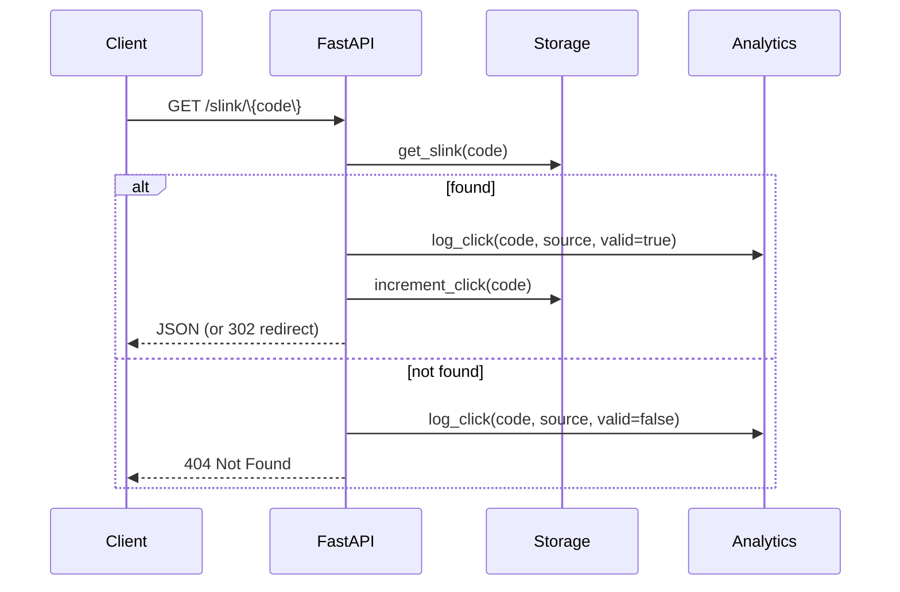

# HLSD — Slink Platform (URL Shortener)

*This document presents the High-Level System Design (HLSD) for a URL Shortening Platform. It outlines the functional requirements, non-functional targets, and architectural choices that demonstrate the ability to design and defend a scalable, reliable system.*

---

## 1) Requirements
##    Functional Requirements
- Short URL Creation
  - Long URL must be valid.
  - No duplicates (long or short) allowed.
  - Shortened URL must be as short as possible.
  - Allowed characters: 0–9, a–z, A–Z.

- Client Redirection
  - Short URL must redirect to the original URL.
  - Redirection requests can come from either a web browser or a RESTful API.

- Analytics
  - Track click events on each short URL.
  - Track API redirection requests.

##    Non-Functional Requirements
1. Support generation of 100 million URLs per day.
2. Handle 1,160 write operations per second.
3. Handle 11,600 read operations per second.
4. Retain data for 10 years:
    - 100 million URLs/day × 365 days × 10 years = 365 billion URLs.
    - At 100 bytes per record → ~36.5 TB total storage.

---

## 2) Assumptions, Design Considerations and Approach
## Assumptions
- URLs to be shortened are public http/https; no authentication in MVP.
- Same long URL should map to the same code (idempotent), unless a valid alias is provided.
- MVP runs with in-memory storage/analytics by default and option to run on DB through configuration; production swap to DB/queue is expected.
- Network reachability checks are optional and not required for correctness.

## Design Considerations
- Deterministic code generation (SHA-256 → Base62) for idempotency; minimal collision extension.
- Bitly like nase62 encoded ID generation for shortest possible code, uniqueness guaranteed within application design.
- Alias takes precedence over generated code; strict Base62 + length validation.
- Redirect path must serve browsers (302) and API clients (JSON) reliably and fast.
- Analytics logs both valid and invalid hits with source (api/browser); eventual consistency is acceptable.
- Clear interfaces (storage, analytics, strategy) to enable DB/Redis/Kafka without changing API.

## Approach
- Layered design: FastAPI (API) → SlinkManager (rules) → Storage (persistence) → Analytics (events).
- Dependency Injection for swappable components and testability.
- Keep hot redirect path lean; add cache/CDN in production for read scaling
- Use environment-driven config (length, strategy, backends) for safe rollouts.
- Comprehensive tests (unit/integration) around manager rules, redirects, and analytics behavior.

---

## 3) Target State Architecture 

```mermaid
flowchart LR
  %% ===== Edge Layer =====
  subgraph Edge["Edge & Security"]
    CDN["Edge Cache"]
    WAF["WAF/ Content Validation + Rate Limiter"]
  end

  %% ===== Clients =====
  subgraph Clients
    Browser["Browser"]
    APIClient["API Client"]
  end

  Browser -->|GET /slink/&#123;code&#125;| CDN
  APIClient -->|POST /slink| WAF
  CDN --> WAF

  %% ===== API Layer =====
  subgraph API["API Layer"]
    GW["API Gateway"]
    APP["FastAPI (app factory)"]
    LB["Load Balancer"]
  end
  WAF --> GW --> LB --> APP

  %% ===== Core Services =====
  subgraph Core["Core Service (Slink Platform)"]
    MAN["SlinkManager\n(validation, dedupe, code strategy)"]
    CACHE[("Redis Cache\n(code→url)")]
    DB[("DB Cluster - node, url, alias, counters")]
  end
  APP --> MAN
  MAN -->|read/write| CACHE
  MAN -->|write/read| DB
  CACHE -->|miss→fallback| DB

  %% ===== Eventing & Analytics =====
  subgraph Events["Eventing & Analytics"]
    BUS["Kafka / Event Bus"]
    PROC["Stream Processor\n(enrich, aggregate)"]
    OLAP[("Columnar Store")]
  end
  APP -->|click events| BUS
  PROC --> OLAP
  BUS --> PROC

  %% ===== Observability =====
  subgraph Obs["Observability"]
    MET["Metrics (p95, QPS)"]
    LOG["Central Logs"]
    TRC["Tracing"]
  end
  APP --> MET
  APP --> LOG
  APP --> TRC
```

## 3.1) AWS Native Target State Architecture 

``` mermaid
flowchart LR
  %% ===== Edge Layer =====
  subgraph Edge["Edge & Security"]
    CDN["Amazon CloudFront (Edge Cache)"]
    WAF["AWS WAF + Rate Limiting / Content Validation"]
  end

  %% ===== Clients =====
  subgraph Clients
    Browser["Browser"]
    APIClient["API Client"]
  end

  Browser -->|GET /slink/&#123;code&#125;| CDN
  APIClient -->|POST /slink| WAF
  CDN --> WAF

  %% ===== API Layer =====
  subgraph API["API Layer"]
    GW["Amazon API Gateway"]
    LB["Application Load Balancer (ALB)"]
    APP["ECS/EKS or EC2 (FastAPI App Nodes)"]
  end
  WAF --> GW --> LB --> APP

  %% ===== Core Services =====
  subgraph Core["Core Service (Slink Platform)"]
    MAN["SlinkManager\n(validation, dedupe, code strategy)"]
    CACHE[("Amazon ElastiCache (Redis)\ncode→url cache")]
    DB[("Amazon Aurora (Postgres/MySQL)\nshortlinks, alias, counters")]
  end
  APP --> MAN
  MAN -->|read/write| CACHE
  MAN -->|write/read| DB
  CACHE -->|miss→fallback| DB

  %% ===== Eventing & Analytics =====
  subgraph Events["Eventing & Analytics"]
    BUS["Amazon MSK (Managed Kafka)"]
    PROC["AWS Kinesis Data Analytics / Lambda\n(enrich, aggregate)"]
    OLAP[("Amazon Redshift / Athena\n(10yr analytics store)")]
  end
  APP -->|click events| BUS
  PROC --> OLAP
  BUS --> PROC

  %% ===== Observability =====
  subgraph Obs["Observability"]
    MET["Amazon CloudWatch Metrics\n(p95, QPS, errors)"]
    LOG["CloudWatch Logs / S3"]
    TRC["AWS X-Ray (Tracing)"]
  end
  APP --> MET
  APP --> LOG
  APP --> TRC

```

## AWS Native Target-State Architecture Walkthrough

| Layer              | AWS Service(s)                         | Role in Architecture | Brief Explanation |
|--------------------|-----------------------------------------|----------------------|-------------------|
| **Clients**        | Browser, API Client                     | Entry point          | End users (browsers) fetch shortened links; API clients create/manage them. |
| **Edge Cache**     | **Amazon CloudFront**                   | Global caching       | Serves hot redirects close to users; reduces latency and offloads backend. |
| **Security**       | **AWS WAF + Rate Limiting**             | Protection           | Filters malicious traffic (XSS, SQLi, bots) and throttles abusive clients. |
| **API Gateway**    | **Amazon API Gateway**                  | API entry            | Handles API client requests: routing, quotas, transformations, auth (future). |
| **Load Balancer**  | **Application Load Balancer (ALB)**     | Traffic distribution | Balances clean traffic across FastAPI app nodes; health checks ensure resilience. |
| **App Layer**      | **ECS/EKS (containers) or EC2**         | Application runtime  | Runs the FastAPI app and `SlinkManager` business logic (validation, dedupe, code strategy). |
| **Cache**          | **Amazon ElastiCache (Redis)**          | Speed layer          | In-memory cache for `code→URL`; absorbs most read traffic, keeps redirects <100ms. |
| **Database**       | **Amazon Aurora (Postgres/MySQL)**      | Truth layer          | Source of truth for links, aliases, counters; enforces uniqueness and durability. |
| **Event Bus**      | **Amazon MSK (Kafka)** or **Kinesis**   | Event streaming      | Collects click/redirect events asynchronously without slowing the main flow. |
| **Stream Processing** | **Kinesis Analytics / Lambda**       | Real-time processing | Aggregates/enriches click events before storing in OLAP for analytics. |
| **Analytics Store**| **Amazon Redshift / Athena (on S3)**    | Long-term analytics  | Stores and queries 10 years of click/usage data at scale (~36.5 TB). |
| **Metrics**        | **CloudWatch Metrics**                  | Observability        | Tracks throughput, error rate, latency (e.g., p95 response times). |
| **Logs**           | **CloudWatch Logs / S3**                | Audit & debugging    | Captures structured logs for ops and troubleshooting. |
| **Tracing**        | **AWS X-Ray**                           | Request tracing      | Provides distributed tracing across API → Manager → DB/Cache → Analytics. |

## 3.2) MVP Architecture 

```mermaid
flowchart LR
  subgraph Clients
    A["Browser"]
    B["API Client"]
    A --- B
  end

  A -->|GET /slink/&#123;code&#125;| API
  B -->|POST /slink| API

  subgraph "Slink Platform (FastAPI)"
    API["FastAPI (app factory)"]
    MAN["SlinkManager - validation, codes, dedupe"]
    ANA["Analytics - in-mem, summary"]
    STO["Storage - in-mem, DI"]

    API --> MAN
    API --> ANA
    MAN --> STO
  end

  STO --> DB["Future: DB/Redis"]
  ANA --> BUS["Future: Kafka/Event Bus"]
  BUS --> OLAP["Future: Columnar Store"]
```

## MVP Architecture Walkthrough

| Layer              | Component                                | Role in Architecture | Brief Explanation |
|--------------------|------------------------------------------|----------------------|-------------------|
| **Clients**        | Browser, API Client                      | Entry point          | Browsers request redirects (`GET /slink/{code}`); API clients create short links (`POST /slink`). |
| **API Layer**      | **FastAPI (app factory)**                | Request handling     | Exposes REST endpoints for creating and resolving short links. Routes requests to business logic. |
| **Business Logic** | **SlinkManager**                         | Rules & validation   | Validates URLs/aliases, avoids duplicates, applies code strategy (shortest Base62), manages redirection. |
| **Analytics**      | **In-memory Analytics**                  | Event tracking       | Logs clicks (valid/invalid, browser/API) and produces summary counts. |
| **Storage**        | **In-memory Storage (DI)**               | Persistence (MVP)    | Holds `{code ↔ URL, alias}` mappings during runtime; designed for dependency injection. |
| **Future Storage** | **DB/Redis**                             | Scalability (future) | Replace in-memory storage with durable DB + Redis cache for production scaling. |
| **Future Analytics** | **Kafka/Event Bus → Columnar Store**   | Long-term analytics  | In MVP, analytics are in-memory only; future design streams click events into Kafka and aggregates in an OLAP store. |
---

## MVP Application Layers

| Layer              | Component(s)            | Role / Definition | How It Works |
|--------------------|-------------------------|------------------|--------------|
| **Clients**        | Browser, API Client     | Entry points      | Browser calls `GET /slink/{code}` for redirects; API client calls `POST /slink` to create links. |
| **API Layer**      | FastAPI (app factory)   | Request handler   | Exposes endpoints (`/slink`, `/slink/{code}`, `/analytics`); parses requests and returns JSON or 302 redirect. |
| **Business Logic** | SlinkManager            | Core rules        | Validates URL/alias, checks duplicates, generates shortest Base62 code, decides redirect behavior. |
| **Analytics**      | In-memory module        | Usage tracking    | Records each hit (valid/invalid, browser/API) and provides a summary endpoint. |
| **Storage**        | In-memory (DI)          | Data store        | Maintains `code ↔ URL/alias` mappings during runtime; designed to be swapped with DB/Redis. |
| **Future Extensions** | DB/Redis, Kafka/OLAP | Scalability path  | DB/Redis provide durability and performance; Kafka/Event Bus + OLAP enable long-term analytics and reporting. |

## 4) Core flows 

### 4.1 Create short link

```mermaid
sequenceDiagram
  participant C as Client
  participant API as FastAPI
  participant MAN as SlinkManager
  participant STO as Storage

  C->>API: POST /slink &#123;url, alias?&#125;
  API->>MAN: create_slink(url, alias?)
  MAN->>MAN: validate URL + alias

  alt alias provided
    MAN->>STO: alias_exists? + save_slink(alias, url)
  else no alias
    MAN->>STO: find_code_by_url(url)
    alt found
      MAN-->>API: return existing code
    else not found
      MAN->>MAN: deterministic base62 len=6
      MAN->>STO: get_slink(code)
      alt free
        MAN->>STO: save_slink(code, url)
      else collision
        MAN->>MAN: extend minimally then salted fallback
        MAN->>STO: save_slink(new_code, url)
      end
    end
  end

  API-->>C: &#123;slink: code, original_url&#125;

```

### 4.2 Redirect + analytics

---

## 5) Logical Data model
**Slinks**
- `code` (PK, Base62, min len 8), `url` (string), `clicks` (int), `alias` (unique, nullable), click_count (int), status (string).

**Click events**
- `code` (FK), `timestamp` (UTC), `source` (`api`|`browser`), `valid` (bool).

In production, click events are **append‑only** to a bus (Kafka/PubSub) and rolled up into aggregates (per code totals, last_click, source breakdown).

---

## 6) AWS Native System Design for Non-Functional Requirements 

### 6.1) Traffic & Scaling Consideration
###  Traffic Profile
- Redirect traffic expected to dominate (~90% reads vs ~10% writes).
- Capacity to be estimated at 2× steady load to accommodate peak hours: **write 2.3k rps**, **read 23k rps**
- Short bursts up to ~3× steady may be absorbed via cache and autoscaling; excess traffic to be throttled gracefully.
  
### Latency Target (p95 < 100 ms for redirects)
- Redirect path expected to resolve primarily from cache for low latency.
- Database access to be minimized and used only on cache miss.
- 95th percentile latency to be monitored; additional capacity provisioned if sustained growth observed.

### Caching Strategy (CDN/ Edge Cache + Redis)
- CDN at edge to serve frequently accessed links.
- Redis cache in application layer to absorb remaining traffic.
- Database to handle only residual load.
- Cache TTLs (time to live) to be tuned for balance between hit ratio and freshness.

### 6.2) Database Considerations

### Read/ Write
- Database load expected to be significantly reduced by caching.
- Read replicas may be introduced for scale-out if cache misses increase.
- Write path focused on durability; indexes maintained on short code and long URL hash.

### Write Path (creation & analytics)
- URL creation to be committed synchronously for correctness.
- Secondary tasks (analytics, abuse checks) to be processed asynchronously.
- Idempotency keys to prevent duplicate entries on retries.

### Capacity & Scaling
- Infrastructure to maintain ~30% headroom beyond peak requirement.
- Autoscaling to be driven by latency and in-flight request metrics.
- Redis scaling to be vertical first; DB scaling through replicas and partitioning.

### 6.3) Storage 

### Data Retention
- Recent analytics data retained in hot storage (30–90 days).
- Older data archived to cost-efficient storage (e.g., object store).

### Failure handling
- Cached data to continue serving during database degradation.
- Cache misses under DB unavailability to return clean errors with retry guidance.

### 6.4) Networking
- Explore Single Region/ Multi-region read replication to be considered in later phases

### 6.5) Observability
- Key metrics: redirect success rate, p95 latency, cache hit ratio (CDN/Redis), DB load, error rate.
- Alerts configuration on deviation from thresholds (e.g., drop in cache hit, rise in latency).

### 6.6) Security & abuse control
- Rate limits per IP/tenant on creation APIs.
- Bot filtering and abuse detection at CDN and application layer.
- Audit logging for admin and maintenance operations.

### 6.7) Cost considerations
- Caching layers to be leveraged to reduce database cost.
- TTL tuning to optimize balance between cost and hit rate.
- Managed services to be preferred for operational efficiency.
- Cost monitoring and tuning to be carried out periodically.
---

## 7) Data Model & Concurrency (Aurora-first)

### Tables (Aurora PostgreSQL)
- `slinks(code PK, url, alias UNIQUE NULL, created_at, status, click_count)`
- `url_index(url UNIQUE)` *(optional for idempotency by URL)*
- `click_events(code, ts, src, valid)` *(optional; can stream only to Kafka instead)*

### Throughput
- 1.1k–2.3k rps writes: Aurora writer scales vertically; add **I/O-Optimized** + **burst capacity**.  
- Reads mostly from Redis/CloudFront; Aurora read replicas handle cache misses and admin/API reads.

### Read Path (p95 < 100 ms)

1. **Browser** → **CloudFront** (cache - path `/{code}`, `Cache-Control: public, max-age=<age>`)  
2. **Miss** → **Application Load Balancer → ECS(FastAPI)** → **Redis GET(code)**  
3. **Miss** → **Aurora SELECT** → populate **Redis (code,url, TTL)**   
4. **Analytics**: Event to **MSK/Kinesis**

### Write Path (Create Link)

1. **API Gateway** → **Application Load Balancer → ECS(FastAPI)**  
2. Validate URL/alias → generate code (deterministic)  
3. **Aurora**: `INSERT` with unique constraints; handle conflict → extend code → retry
4. **Optionally warm Redis** 
5. Publish **create** event to **MSK/Kinesis** (async)

## 8) Analytics & 10-Year Retention

- **Event capture**: App → **MSK/Kinesis** (`{code, ts, src, valid, ua/ip (hashed)}`)  
- **Stream processing**: Lambda → rolling aggregates (per code/day, per src)  
- **Storage**:  
  - **Raw**: S3 (Parquet) partitioned by `dt=YYYY-MM-DD`  
  - **Query**: Athena (serverless) *or* Redshift external tables
- **Cost**: S3 + Athena cheapest for long tail; Redshift for heavy, frequent dashboards.

## 9) Availability, DR, and Scaling

| **Area**                      | **Approach**                                                                                | **Notes**                                        |
| ----------------------------- | ------------------------------------------------------------------------------------------- | ------------------------------------------------ |
| **Availability**              | Multi-AZ for ALB, ECS/Fargate, ElastiCache (replication group), Aurora (1 writer + readers) | Survives AZ loss; services remain operational.   |
| **Disaster Recovery**         | Aurora Global Database (readable standby in another region); DNS failover                   | Cross-region protection; **RTO/RPO in minutes**. |
| **Scaling**                   | Auto Scaling for ECS (CPU/RPS); ElastiCache shards; Aurora replicas/capacity                | Scales up/down automatically with load.          |
| **Deployment**                | Blue/Green: ECS task sets + ALB weighted routing; Aurora Blue/Green                         | Enables **zero-downtime upgrades**.              |

## 10) Security & Ops 
- **WAF**: bot control, IP throttling.  
- **API GW**: auth  
- **Secrets** in **Secrets Manager**; configs in **SSM**.  
- **CloudWatch** alarms on p95, error rate, Redis hit ratio, DB connections/latency.  

## 11) Configuration Defaults ( Initial)
- CloudFront TTL: **60s** for redirects (can be tuned later, shorter TTL for freshness and longer for efficiency).  
- Redis: **cluster mode**, Cache Eviction Policy **allkeys-lfu**, TTL **1–10 min** for codes.  
- Aurora: **Serverless v2** (dev) → **Provisioned + read replicas** (prod), **I/O-Optimized**.  
- API GW throttles: e.g., **1k rps** burst per API key - prvents abuse, protects backend from overload.

## 12) CAP & correctness
- **Redirects** favor **CP** (correct code→URL mapping) — better to be slightly slower than to redirect wrongly.
- **Analytics** can be **AP** — counts can lag during partitions; they catch up.

## 13) Notable trade‑off
- In‑memory baseline is **not durable** — chosen for speed and testability. 
- Postgres DB storage implementation locally for configurability and ease of integration
- DB/Redis is the next incremental step.

## 14) API sketch (for quick smoke testing)
- `POST /slink` → `{url, alias?}` → `{"slink": "<code>", "original_url": "<url>"}`
- `GET /slink/{code}` → JSON `{original_url, clicks}` (or 302 in browser mode)
- `GET /analytics/summary?only_valid=true|false`
- `GET /health_link` → `{"status":"ok"}`

## 15) Possible Production-Ready Additions
- Swap storage to **Postgres/Redis**; add a tiny **Redis GET/SET** caching layer.
- Add **Kafka** producer for click events; nightly OLAP rollups for reports.
- Add **create‑rate limiting** 
